# Home Assistant Multizone Climate - System Diagrams

This document contains comprehensive diagrams illustrating the algorithms, flows, and automations of the Home Assistant Multizone Climate integration.

## Quick Reference Guide

**New to the system?** Start here:
- [System Architecture Overview](#system-architecture-overview) - See how all components fit together
- [System Component Integration](#system-component-integration) - Understand external systems and HA integration

**Understanding the algorithms?** Check these:
- [Calculate Main Target Temperature](#calculate-main-target-temperature-algorithm) - How main thermostat target is determined
- [Update Valves Algorithm](#update-valves-algorithm) - How zones control their valves
- [Zone Satisfaction State Machine](#zone-satisfaction-state-machine) - State transitions with hysteresis

**Implementing the system?** Essential diagrams:
- [Redis Data Schema](#redis-data-schema) - Complete data model
- [Background Jobs and Process Locking](#background-jobs-and-process-locking) - Job execution flow
- [Coordinator Process Flow](#coordinator-process-flow) - Main 15s cycle

**Debugging issues?** Look at:
- [Timing Sequences](#timing-sequences) - Real-world execution timelines
- [Valve Lock Mechanism](#valve-lock-mechanism) - Preventing valve chattering
- [Error Handling and Recovery](#error-handling-and-recovery) - Failure modes and retries

**Safety critical?** Must read:
- [Safety Valve Check Algorithm](#safety-valve-check-algorithm) - Minimum valve enforcement
- [Open-First-Then-Close Sequence](#open-first-then-close-sequence) - Maintaining system flow

## Table of Contents
1. [System Architecture Overview](#system-architecture-overview)
2. [Calculate Main Target Temperature Algorithm](#calculate-main-target-temperature-algorithm)
3. [Update Valves Algorithm](#update-valves-algorithm)
4. [Safety Valve Check Algorithm](#safety-valve-check-algorithm)
5. [Zone Satisfaction State Machine](#zone-satisfaction-state-machine)
6. [Background Jobs and Process Locking](#background-jobs-and-process-locking)
7. [Redis Data Schema](#redis-data-schema)
8. [Automation Flow](#automation-flow)
9. [Coordinator Process Flow](#coordinator-process-flow)
10. [Timing Sequences](#timing-sequences)
11. [Open-First-Then-Close Sequence](#open-first-then-close-sequence)
12. [System Component Integration](#system-component-integration)
13. [Priority Sorting Example](#priority-sorting-example)
14. [Configuration Flow](#configuration-flow)
15. [Valve Lock Mechanism](#valve-lock-mechanism)
16. [Multizone Enable/Disable States](#multizone-enable-disable-states)
17. [Error Handling and Recovery](#error-handling-and-recovery)

---

## System Architecture Overview

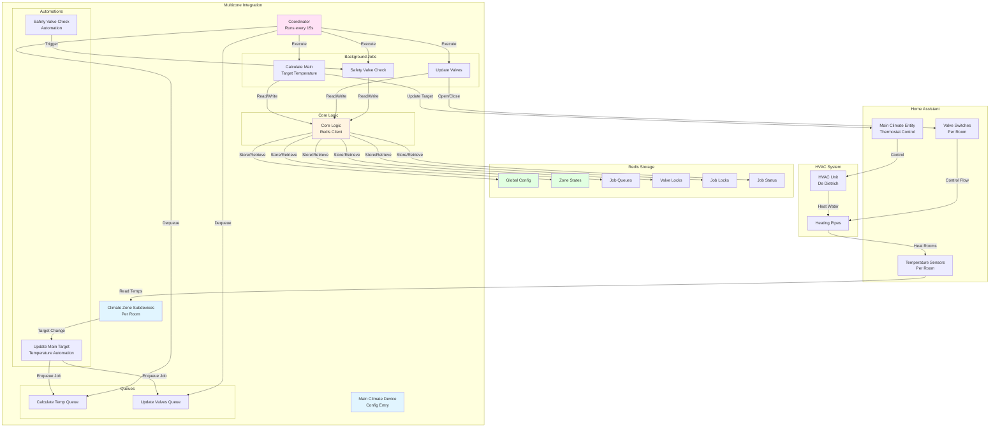

---

## Calculate Main Target Temperature Algorithm

### Slider-Based Linear Interpolation (Choice A)

```mermaid
flowchart TD
    Start([Start: Calculate Main Target]) --> CheckZones{Active Zones<br/>Available?}
    
    CheckZones -->|No| ReturnNull[Return None]
    CheckZones -->|Yes| FilterOff[Filter: Get Active Zones<br/>state != OFF]
    
    FilterOff --> CheckActive{Active Zones<br/>Found?}
    CheckActive -->|No| ReturnNull
    CheckActive -->|Yes| FilterOverheat[Filter: Exclude Overheated Zones<br/>satisfaction != overheated]
    
    FilterOverheat --> CheckNonOverheat{Non-Overheated<br/>Zones Found?}
    CheckNonOverheat -->|Yes| UseNonOverheat[Use Non-Overheated Zone Targets]
    CheckNonOverheat -->|No| UseAll[Use All Active Zone Targets<br/>Fallback]
    
    UseNonOverheat --> CheckMode{Calculation<br/>Mode?}
    UseAll --> CheckMode
    
    CheckMode -->|Average Mode| CalcAverage[main_target_raw =<br/>sum of targets / count]
    CheckMode -->|Slider Mode| FindMinMax[Find min and max targets]
    
    FindMinMax --> CheckEqual{min == max?}
    CheckEqual -->|Yes| UseSingle[main_target_raw = min]
    CheckEqual -->|No| CalcInterp[main_target_raw = min +<br/>slider × (max - min)]
    
    CalcAverage --> Round
    UseSingle --> Round
    CalcInterp --> Round
    
    Round[Round to nearest 0.5°C<br/>(round(value × 2)) / 2] --> Clamp[Clamp to limits<br/>main_min_temp, main_max_temp]
    
    Clamp --> CheckThreshold{abs(main_target -<br/>current_main_target)<br/>>= threshold?}
    
    CheckThreshold -->|No| ReturnNull
    CheckThreshold -->|Yes| ReturnTarget[Return main_target]
    
    ReturnTarget --> UpdateClimate[Update Main Climate<br/>Entity Target]
    ReturnNull --> End([End])
    UpdateClimate --> End
    
    style Start fill:#e1f5ff
    style End fill:#e1f5ff
    style CheckMode fill:#fff4e1
    style UpdateClimate fill:#ffe1e1
```

### Example Calculation Flow

```mermaid
flowchart LR
    subgraph Input
        Z1[Bedroom: 20°C]
        Z2[Living: 22°C]
        Z3[Kitchen: 19°C]
        Z4[Bath: 23°C]
    end
    
    subgraph Config
        Slider[Slider: 0.5 (50%)]
        Min[Min: 18°C]
        Max[Max: 30°C]
        Thresh[Threshold: 0.5°C]
    end
    
    subgraph Calculation
        FindRange[Min: 19°C<br/>Max: 23°C]
        Interpolate[19 + 0.5 × (23-19)<br/>= 19 + 2 = 21°C]
        RoundVal[Round: 21.0°C]
        ClampVal[Clamp: 21.0°C<br/>within 18-30]
    end
    
    subgraph Output
        Result[Main Target: 21.0°C]
    end
    
    Z1 & Z2 & Z3 & Z4 --> FindRange
    Slider --> Interpolate
    FindRange --> Interpolate
    Interpolate --> RoundVal
    RoundVal --> ClampVal
    Min & Max --> ClampVal
    ClampVal --> Result
    
    style Input fill:#e1f5ff
    style Config fill:#fff4e1
    style Calculation fill:#ffe1f5
    style Output fill:#e1ffe1
```

---

## Update Valves Algorithm

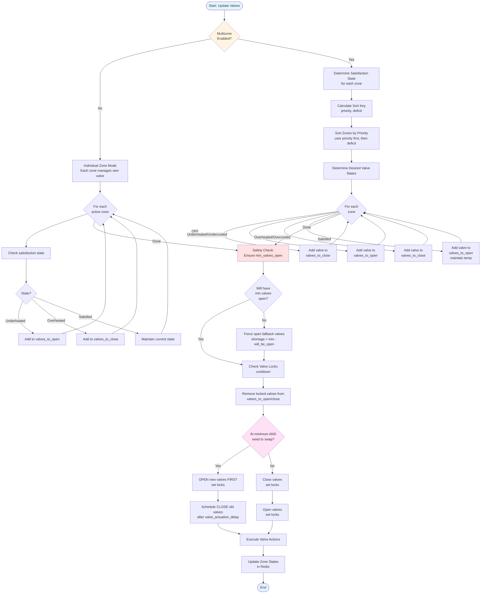

---

## Safety Valve Check Algorithm

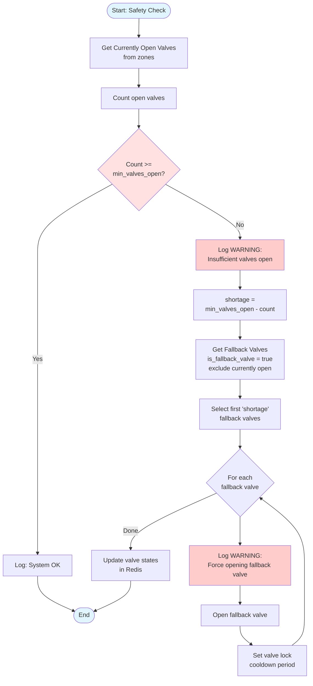

---

## Zone Satisfaction State Machine

### Heating Mode State Transitions

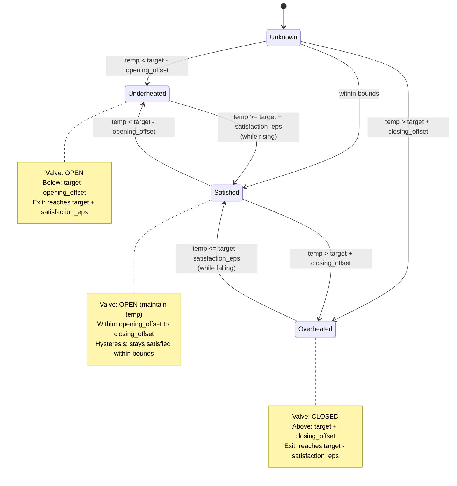

### Cooling Mode State Transitions


### Satisfaction Boundaries Diagram

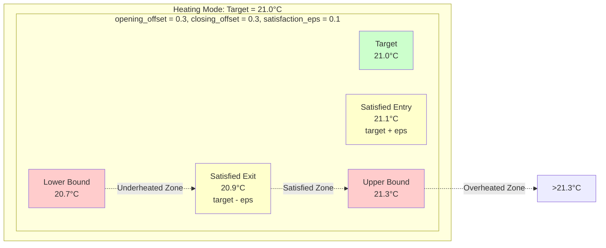

---

## Background Jobs and Process Locking

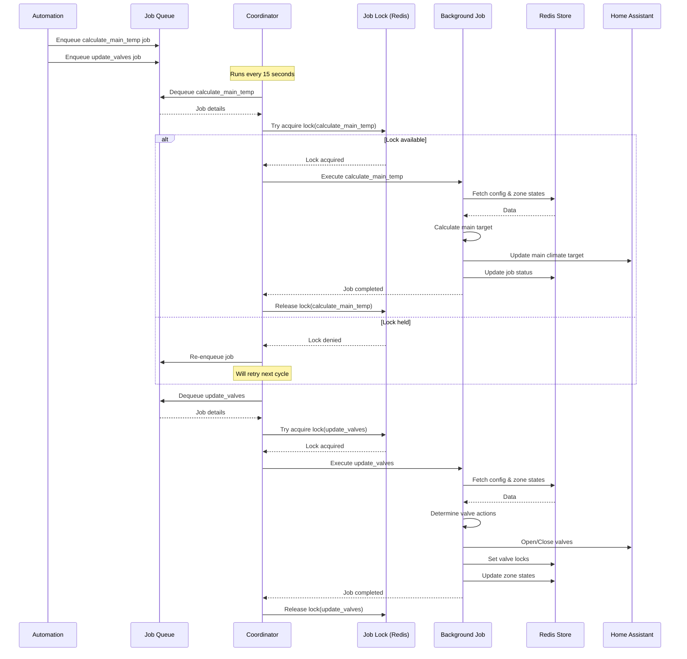

### Job Queue Management

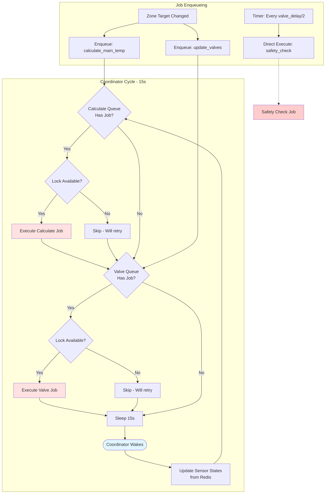

---

## Redis Data Schema

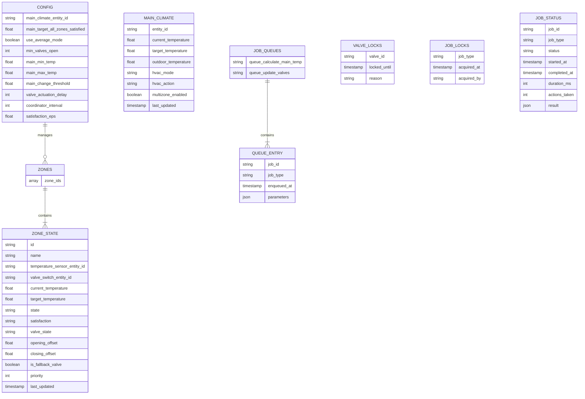

### Redis Key Structure

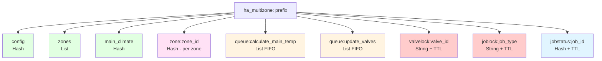

---

## Automation Flow

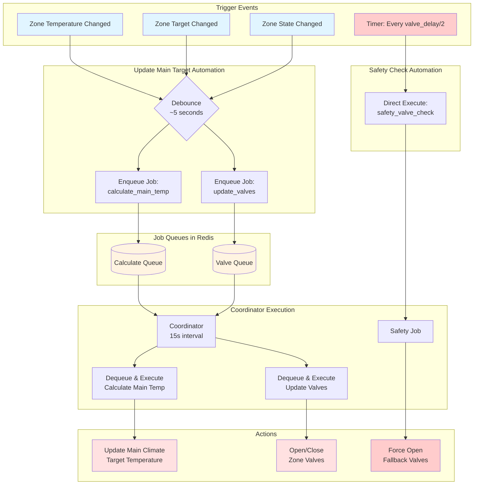

---

## Coordinator Process Flow

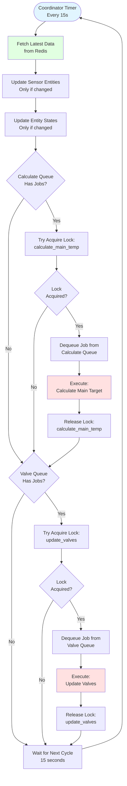

---

## Timing Sequences

### Scenario 1: Zone Temperature Drop

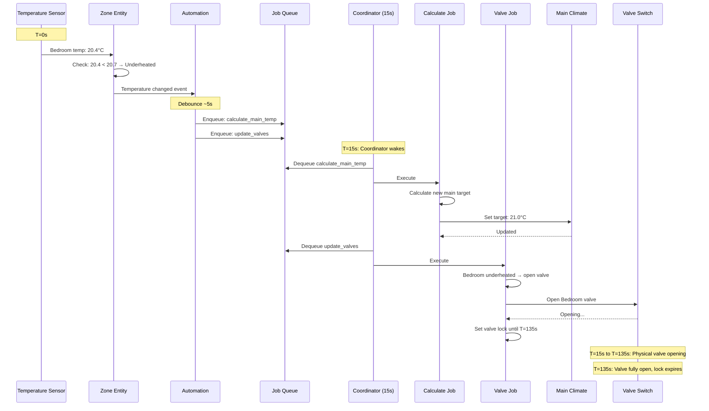

### Scenario 2: Multiple Rapid Changes

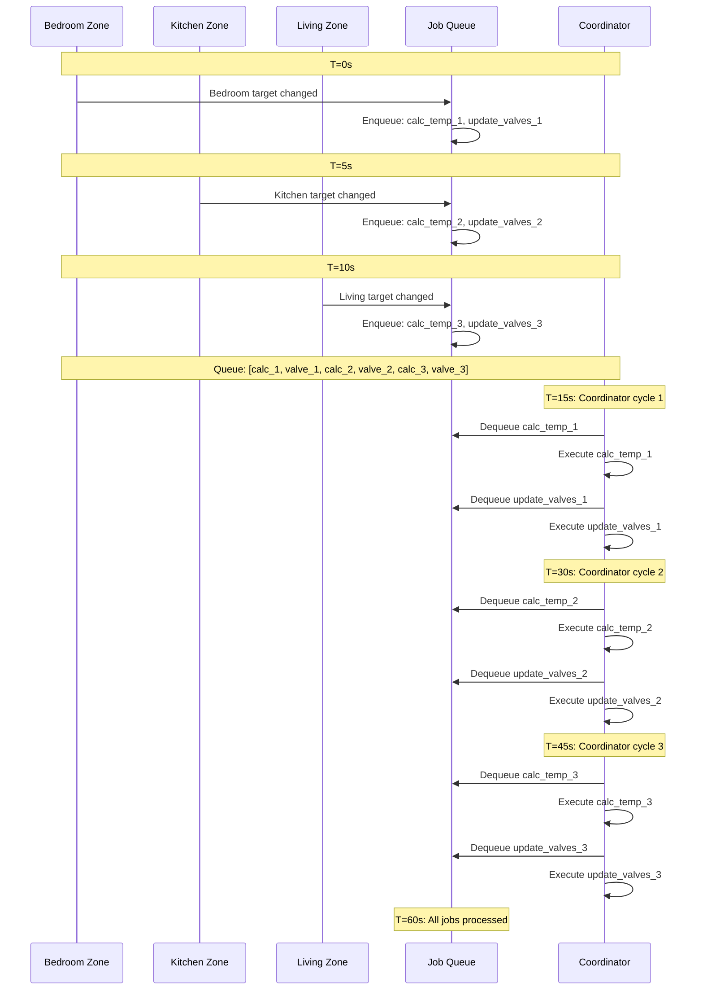

---

## Open-First-Then-Close Sequence

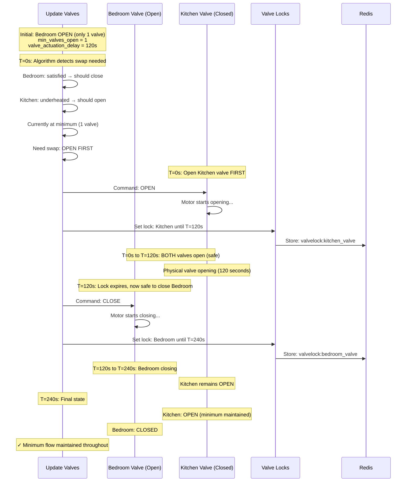

### Safety Guarantee Diagram

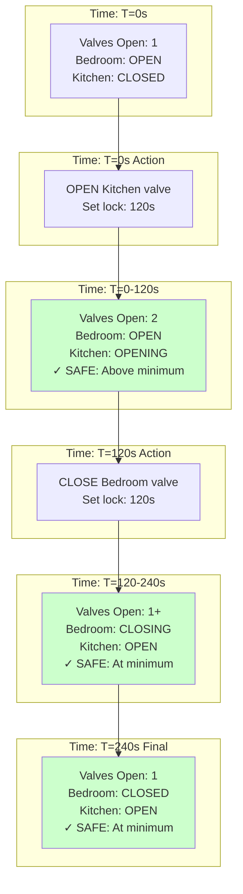

---

## System Component Integration

```mermaid
graph TB
    subgraph "External Systems"
        HVAC[HVAC Unit<br/>De Dietrich Strateo]
        Cloud[Cloud API<br/>Remeha]
        HeatPipes[Heating Pipes<br/>Water Circulation]
    end
    
    subgraph "Home Assistant Core"
        MainThermo[Main Thermostat Entity<br/>remeha_home_by_chester]
        TempSensors[Temperature Sensors<br/>Per Room]
        ValveSwitches[Valve Switches<br/>Per Room]
    end
    
    subgraph "Multizone Integration Components"
        subgraph "Config Entry"
            MainDevice[Main Climate Device]
            ZoneDevices[Zone Climate Devices]
            ConfigFlow[Configuration Flow]
        end
        
        subgraph "Core Components"
            CoreLogic[Core Logic<br/>Redis Client]
            Coordinator[Data Update Coordinator<br/>15s interval]
        end
        
        subgraph "Background Services"
            CalcService[Calculate Main Target Service]
            ValveService[Update Valves Service]
            SafetyService[Safety Check Service]
        end
        
        subgraph "Automations"
            TempAuto[Temperature Change Automation]
            SafetyAuto[Safety Timer Automation]
        end
        
        subgraph "Entities"
            ClimatePlatform[Climate Platform<br/>Zone Entities]
            SensorPlatform[Sensor Platform<br/>State Sensors]
            SwitchPlatform[Switch Platform<br/>Multizone Enable]
        end
    end
    
    subgraph "Redis Database"
        GlobalConfig[Global Config]
        ZoneStates[Zone States]
        Queues[Job Queues]
        Locks[Locks & Status]
    end
    
    subgraph "Frontend UI"
        IntegrationUI[Integration Setup UI]
        ConfigEditor[Config Editor]
        ZoneManager[Zone Manager]
        Cards[Lovelace Cards]
        Dashboards[Dashboards]
    end
    
    %% External connections
    HVAC <-->|WiFi/Cloud| Cloud
    Cloud <-->|API| MainThermo
    HVAC -->|Heat Water| HeatPipes
    HeatPipes -->|Heat Rooms| TempSensors
    
    %% HA Core connections
    MainThermo -->|Read/Write| MainDevice
    TempSensors -->|Read Temps| ZoneDevices
    ValveSwitches <-->|Control| ValveService
    
    %% Integration internal
    ConfigFlow -->|Setup| MainDevice
    ConfigFlow -->|Setup| ZoneDevices
    
    TempSensors -->|State Change| TempAuto
    ZoneDevices -->|Target Change| TempAuto
    TempAuto -->|Enqueue Jobs| Queues
    
    SafetyAuto -->|Trigger| SafetyService
    
    Coordinator -->|Dequeue| Queues
    Coordinator -->|Execute| CalcService
    Coordinator -->|Execute| ValveService
    Coordinator -->|Update| SensorPlatform
    
    CalcService -->|Use| CoreLogic
    ValveService -->|Use| CoreLogic
    SafetyService -->|Use| CoreLogic
    
    CoreLogic <-->|Store/Retrieve| GlobalConfig
    CoreLogic <-->|Store/Retrieve| ZoneStates
    CoreLogic <-->|Store/Retrieve| Locks
    
    MainDevice -->|Expose| ClimatePlatform
    ZoneDevices -->|Expose| ClimatePlatform
    
    SwitchPlatform -->|Enable/Disable| Coordinator
    
    %% Frontend connections
    IntegrationUI -->|Configure| ConfigFlow
    ConfigEditor <-->|Read/Write| GlobalConfig
    ZoneManager <-->|Manage| ZoneStates
    Cards -->|Display| ClimatePlatform
    Cards -->|Display| SensorPlatform
    Dashboards -->|Compose| Cards
    
    style HVAC fill:#ffcccc
    style MainThermo fill:#e1f5ff
    style CoreLogic fill:#fff4e1
    style Coordinator fill:#ffe1f5
    style GlobalConfig fill:#e1ffe1
    style Cards fill:#e1e1ff
```

### Data Flow: User Changes Zone Target

```mermaid
flowchart LR
    User[User] -->|Sets Target| Card[Lovelace Climate Card]
    Card -->|Update| ZoneEntity[Zone Climate Entity]
    ZoneEntity -->|Write| Redis[(Redis: Zone State)]
    ZoneEntity -->|Fire Event| Auto[Temperature Change Automation]
    Auto -->|Enqueue| Queue[(Job Queue)]
    Queue -->|Wait| Coord[Coordinator: Next Cycle]
    Coord -->|Dequeue & Execute| CalcJob[Calculate Main Target Job]
    CalcJob -->|Read| Redis
    CalcJob -->|Calculate| NewTarget[New Main Target]
    NewTarget -->|Update| MainClimate[Main Climate Entity]
    MainClimate -->|API Call| Cloud[Cloud API]
    Cloud -->|Control| HVAC[HVAC Unit]
    
    Coord -->|Dequeue & Execute| ValveJob[Update Valves Job]
    ValveJob -->|Read| Redis
    ValveJob -->|Determine Actions| Actions[Valve Actions]
    Actions -->|Open/Close| ValveSwitches[Valve Switches]
    ValveSwitches -->|Physical Control| Valves[Physical Valves]
    
    style User fill:#e1f5ff
    style Redis fill:#e1ffe1
    style HVAC fill:#ffcccc
    style Valves fill:#ffe1e1
```

---

## Priority Sorting Example

```mermaid
graph TD
    subgraph "Zones with Priority"
        ZA["Zone A: Bedroom<br/>Priority: 10<br/>Target: 21°C, Current: 19°C<br/>Deficit: 2.0°C<br/>Sort Key: (10, 2.0)"]
        
        ZB["Zone B: Kitchen<br/>Priority: 5<br/>Target: 22°C, Current: 19°C<br/>Deficit: 3.0°C<br/>Sort Key: (5, 3.0)"]
        
        ZC["Zone C: Living<br/>Priority: 0<br/>Target: 20°C, Current: 16°C<br/>Deficit: 4.0°C<br/>Sort Key: (0, 4.0)"]
        
        ZD["Zone D: Bathroom<br/>Priority: 0<br/>Target: 23°C, Current: 22°C<br/>Deficit: 1.0°C<br/>Sort Key: (0, 1.0)"]
    end
    
    subgraph "Sorted Order (High to Low Priority)"
        S1["1st: Zone A<br/>Highest user priority"]
        S2["2nd: Zone B<br/>Second user priority"]
        S3["3rd: Zone C<br/>Default priority, largest deficit"]
        S4["4th: Zone D<br/>Default priority, smallest deficit"]
    end
    
    ZA --> S1
    ZB --> S2
    ZC --> S3
    ZD --> S4
    
    S1 --> Action1[Managed First]
    S2 --> Action2[Managed Second]
    S3 --> Action3[Managed Third]
    S4 --> Action4[Managed Last]
    
    style S1 fill:#ffcccc
    style S2 fill:#ffddcc
    style S3 fill:#ffeecc
    style S4 fill:#ffffcc
```

---

## Configuration Flow

```mermaid
flowchart TD
    Start([User Adds Integration]) --> Welcome[Welcome Screen<br/>Multizone Climate]
    
    Welcome --> RedisConfig[Configure Redis Connection]
    RedisConfig -->|Input| RedisFields["Host: localhost<br/>Port: 6379<br/>Password: optional<br/>DB: 0<br/>Prefix: ha_multizone"]
    
    RedisFields --> TestRedis{Test Redis<br/>Connection}
    TestRedis -->|Failed| RedisError[Show Error]
    RedisError --> RedisConfig
    TestRedis -->|Success| MainClimateConfig
    
    MainClimateConfig[Select Main Climate Entity] -->|Entity Selector| MainEntity[climate.main_thermostat]
    
    MainEntity --> AutoConfig[Configure Automation Settings]
    AutoConfig -->|Input| AutoFields["Mode: Slider/Average<br/>Slider: 50% default<br/>Min Valves: 1<br/>Min Temp: 18°C<br/>Max Temp: 30°C<br/>Change Threshold: 0.5°C<br/>Valve Delay: 120s<br/>Satisfaction Eps: 0.0°C"]
    
    AutoFields --> Validate{Validate<br/>Config}
    Validate -->|Invalid| ShowValidation[Show Validation Errors]
    ShowValidation --> AutoConfig
    
    Validate -->|Valid| CreateEntry[Create Config Entry]
    CreateEntry --> SetupDevice[Setup Main Climate Device]
    SetupDevice --> InitRedis[Initialize Redis Schema]
    InitRedis --> Complete[Setup Complete]
    
    Complete --> ShowOptions[Show Options:<br/>Add Climate Zone]
    
    style Start fill:#e1f5ff
    style Complete fill:#ccffcc
    style RedisError fill:#ffcccc
    style ShowValidation fill:#ffcccc
```

### Add Zone Flow

```mermaid
flowchart TD
    Start([User Adds Zone]) --> ZoneForm[Zone Configuration Form]
    
    ZoneForm -->|Input| ZoneFields["Name: Bedroom<br/>Temp Sensor: sensor.bedroom_temp<br/>Valve Switch: switch.bedroom_valve<br/>Target Threshold: 0.1°C<br/>Opening Offset: 0.3°C<br/>Closing Offset: 0.3°C<br/>Is Fallback: false<br/>Priority: 0"]
    
    ZoneFields --> ValidateZone{Validate<br/>Entities Exist?}
    ValidateZone -->|No| EntityError[Show Error:<br/>Entity not found]
    EntityError --> ZoneForm
    
    ValidateZone -->|Yes| CheckFallback{Check Fallback<br/>Requirements}
    CheckFallback -->|Need more fallbacks| WarnFallback[Warn: Configure as fallback?]
    WarnFallback --> ZoneForm
    
    CheckFallback -->|OK| CreateZone[Create Zone Device]
    CreateZone --> StoreRedis[Store Zone in Redis]
    StoreRedis --> CreateEntity[Create Climate Entity]
    CreateEntity --> InitialState[Set Initial State: OFF]
    InitialState --> ZoneComplete[Zone Added]
    
    ZoneComplete --> EnableOption[User can now:<br/>Turn zone ON<br/>Set target temp<br/>Enable multizone]
    
    style Start fill:#e1f5ff
    style ZoneComplete fill:#ccffcc
    style EntityError fill:#ffcccc
    style WarnFallback fill:#ffffcc
```

---

## Valve Lock Mechanism

```mermaid
sequenceDiagram
    participant Algo as Update Valves Algorithm
    participant Redis as Redis
    participant Valve as Physical Valve
    
    Note over Algo: T=0s: Need to open Bedroom valve
    
    Algo->>Redis: Check: Is bedroom_valve locked?
    Redis-->>Algo: No lock found
    
    Algo->>Valve: Command: OPEN
    Valve->>Valve: Motor activates...
    
    Algo->>Redis: Set lock: bedroom_valve<br/>locked_until = T+120s<br/>TTL = 120s
    Redis-->>Algo: Lock set
    
    Note over Valve: T=0 to T=120s: Physical valve opening
    
    Note over Algo: T=30s: Algorithm runs again
    Algo->>Redis: Check: Is bedroom_valve locked?
    Redis-->>Algo: Locked until T=120s
    Algo->>Algo: Skip valve action (locked)
    
    Note over Algo: T=90s: Algorithm runs again
    Algo->>Redis: Check: Is bedroom_valve locked?
    Redis-->>Algo: Locked until T=120s
    Algo->>Algo: Skip valve action (locked)
    
    Note over Valve: T=120s: Valve fully open
    Note over Redis: T=120s: Lock TTL expires automatically
    
    Note over Algo: T=125s: Algorithm runs again
    Algo->>Redis: Check: Is bedroom_valve locked?
    Redis-->>Algo: No lock (expired)
    Algo->>Algo: Valve can be actuated again
```

---

## Multizone Enable/Disable States

```mermaid
stateDiagram-v2
    [*] --> Disabled: Initial Setup
    
    Disabled --> CheckZones: User enables multizone
    CheckZones --> Disabled: No zones configured
    CheckZones --> CheckActive: Zones exist
    
    CheckActive --> Disabled: No zones turned ON
    CheckActive --> Enabled: At least 1 zone ON
    
    Enabled --> Operating: Automations active
    Operating --> Enabled: Continue operation
    
    Enabled --> Disabled: User disables OR<br/>All zones turned OFF
    
    note right of Disabled
        - Multizone switch: OFF
        - Each zone manages own valve
        - Safety check still runs
        - Main climate: manual control
    end note
    
    note right of Enabled
        - Multizone switch: ON
        - Coordinated valve management
        - Main target auto-calculated
        - Automations active
    end note
    
    note right of Operating
        - Coordinator runs every 15s
        - Jobs process from queues
        - Valves coordinated
        - Main target updated
    end note
```

---

## Error Handling and Recovery

```mermaid
flowchart TD
    Start([Job Execution]) --> TryAcquire{Try Acquire<br/>Job Lock}
    
    TryAcquire -->|Timeout/Failed| Requeue1[Re-enqueue Job]
    Requeue1 --> End1([Will Retry Next Cycle])
    
    TryAcquire -->|Success| Execute[Execute Job Logic]
    
    Execute --> TryRedis{Redis<br/>Connection OK?}
    TryRedis -->|No| LogError1[Log Error: Redis unavailable]
    LogError1 --> ReleaseLock1[Release Job Lock]
    ReleaseLock1 --> Requeue2[Re-enqueue Job]
    Requeue2 --> End2([Will Retry Next Cycle])
    
    TryRedis -->|Yes| TryHA{HA API<br/>Call OK?}
    TryHA -->|No| LogError2[Log Error: HA API failed]
    LogError2 --> CheckRetry{Retry<br/>Count < 3?}
    CheckRetry -->|Yes| ReleaseLock2[Release Job Lock]
    ReleaseLock2 --> Requeue3[Re-enqueue Job]
    Requeue3 --> End3([Will Retry Next Cycle])
    CheckRetry -->|No| LogCritical[Log Critical: Job failed]
    LogCritical --> UpdateStatus1[Update Job Status: FAILED]
    UpdateStatus1 --> ReleaseLock3[Release Job Lock]
    ReleaseLock3 --> End4([Job Abandoned])
    
    TryHA -->|Success| UpdateStatus2[Update Job Status: COMPLETED]
    UpdateStatus2 --> ReleaseLock4[Release Job Lock]
    ReleaseLock4 --> End5([Job Success])
    
    style LogError1 fill:#ffcccc
    style LogError2 fill:#ffcccc
    style LogCritical fill:#ff9999
    style End5 fill:#ccffcc
```

---

## Summary

This document provides comprehensive visual representations of:

1. **System Architecture** - Overall component structure and data flow
2. **Core Algorithms** - Calculate main target, update valves, safety checks
3. **State Machines** - Zone satisfaction state transitions with hysteresis
4. **Process Management** - Job queuing, locking, and coordination
5. **Data Schema** - Redis storage structure and key patterns
6. **Automation Flows** - Event triggers and job execution
7. **Timing Sequences** - Real-time behavior and valve coordination
8. **Safety Mechanisms** - Open-first-then-close, valve locks, minimum valves
9. **Configuration** - Setup flows and user interfaces
10. **Error Handling** - Recovery and retry mechanisms

All diagrams use Mermaid syntax for easy rendering in GitHub, documentation tools, and Markdown viewers.

---

## Viewing These Diagrams

### GitHub
These diagrams render automatically when viewing this file on GitHub.

### Automated PDF Generation
When DIAGRAMS.md is updated in the `master` or `dev` branches, a PDF is automatically generated via GitHub Actions:
- **Download**: Go to [Actions → Generate Diagrams PDF](../../actions/workflows/generate-diagrams-pdf.yml) and download the latest artifact
- **Manual Trigger**: You can also manually trigger the workflow from the Actions tab
- **Auto-commit**: The generated PDF is automatically committed back to the repository

### VS Code
Install the "Markdown Preview Mermaid Support" extension.

### Command Line
Use `mermaid-cli` to generate images locally:
```bash
npm install -g @mermaid-js/mermaid-cli
mmdc -i DIAGRAMS.md -o diagrams.pdf -t dark -b transparent
```

### Online
Copy any diagram to [Mermaid Live Editor](https://mermaid.live/) for interactive viewing and editing.
