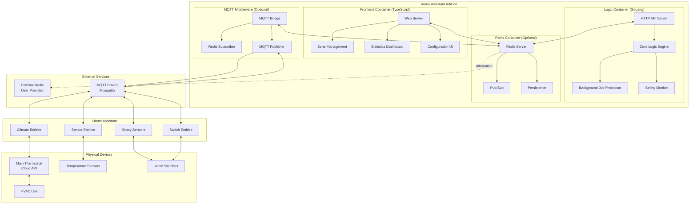
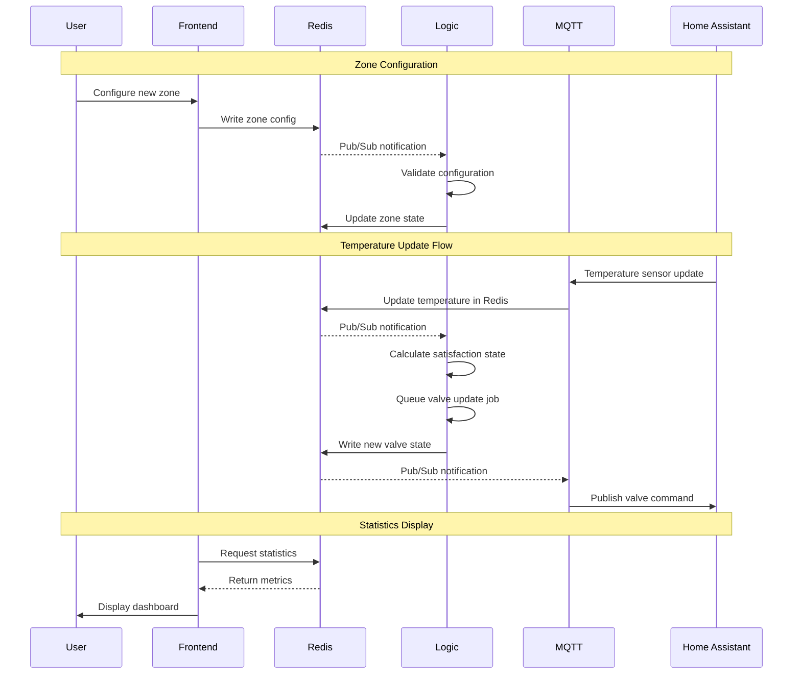
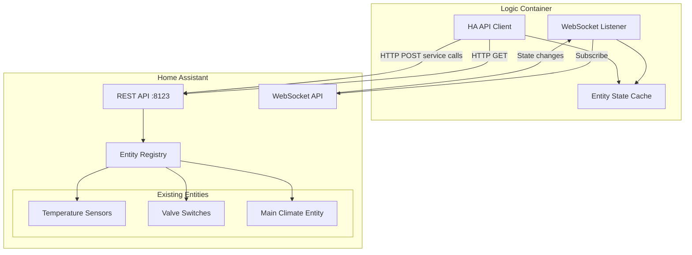
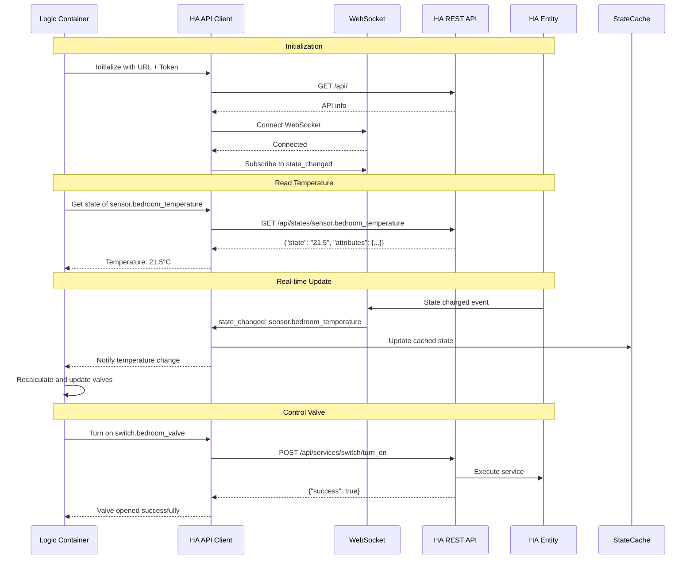
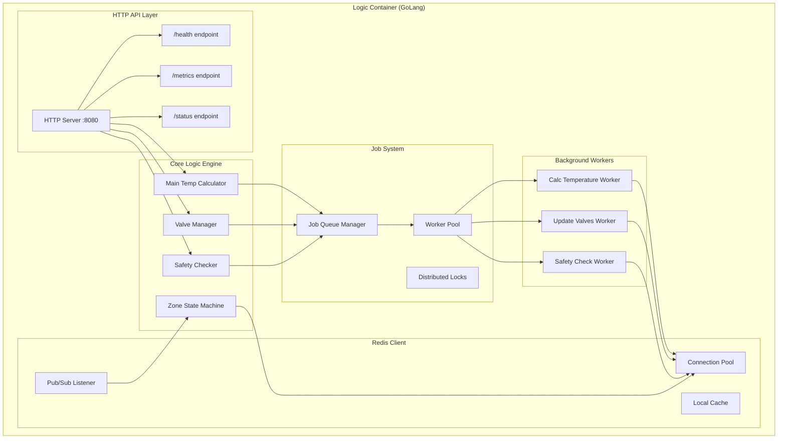
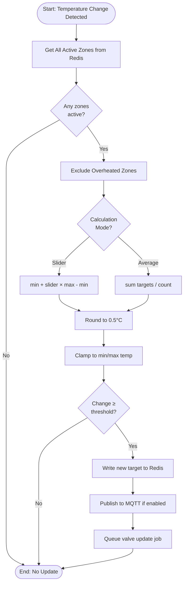
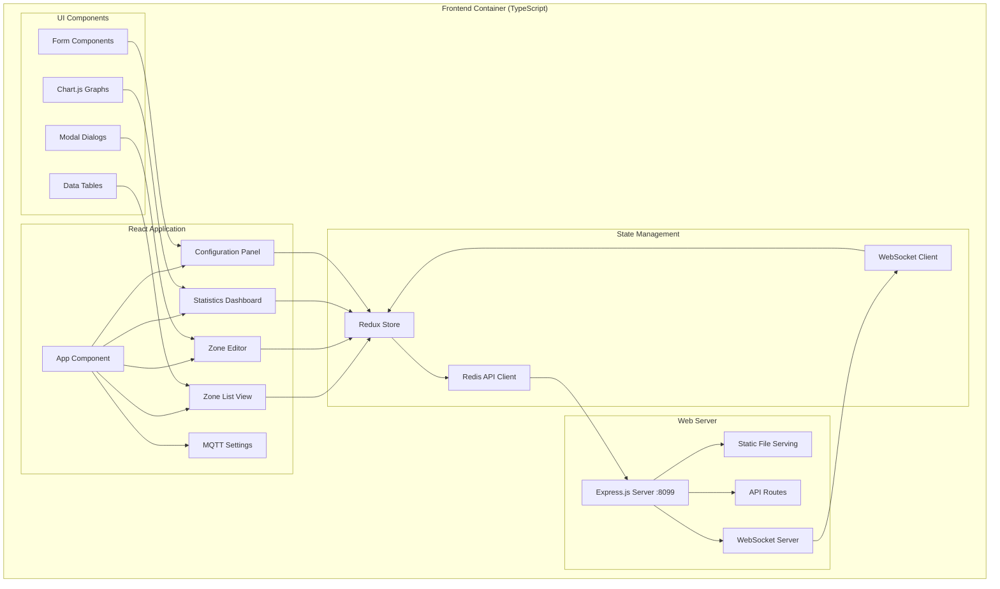
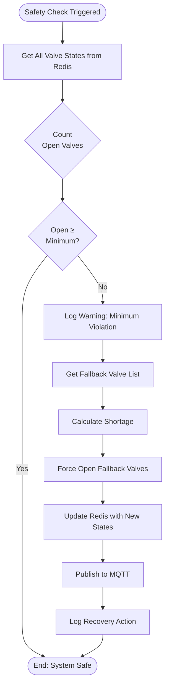
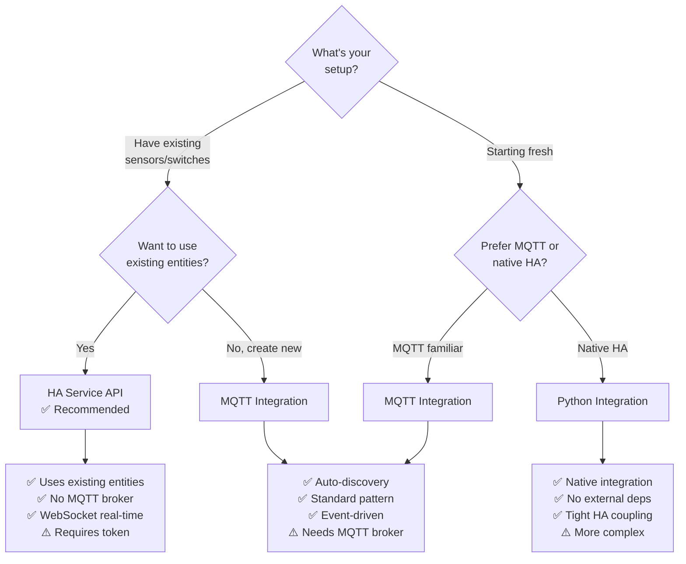

# Home Assistant Multizone Climate - System Diagrams v2.0

This document contains comprehensive diagrams illustrating the architecture, flows, and algorithms of the containerized Multizone Climate add-on.

## Architecture Overview

The system uses a modern microservices architecture with separate containers for logic, frontend, and optional MQTT middleware.

## Quick Reference Guide

**New to the system?** Start here:
- [Containerized Architecture](#containerized-architecture) - Multi-container add-on structure
- [Component Communication](#component-communication) - How containers interact
- [Integration Options](#integration-options) - MQTT vs HA Service API vs Python

**Understanding the containers?** Check these:
- [Logic Container (GoLang)](#logic-container-golang) - Core algorithms and business logic
- [Frontend Container (TypeScript)](#frontend-container-typescript) - Web UI and management
- [MQTT Middleware](#mqtt-middleware-container) - Redis to MQTT bridge
- [HA Service API Client](#ha-service-api-client) - Direct HA integration

**Data flow?** Essential diagrams:
- [Redis Data Schema](#redis-data-schema) - Complete data model
- [State Synchronization](#state-synchronization) - Redis ↔ MQTT ↔ Home Assistant
- [HA API Communication Flow](#ha-api-communication-flow) - Service API integration
- [Job Processing Flow](#job-processing-flow) - Background job execution

**Integration patterns?** Look at:
- [MQTT Topic Structure](#mqtt-topic-structure) - Topic hierarchy and payloads
- [Entity Discovery](#entity-discovery) - Home Assistant auto-discovery (MQTT)
- [HA Service API Calls](#ha-service-api-calls) - REST API and WebSocket
- [Entity ID Mapping](#entity-id-mapping) - Existing entity usage

**Algorithms?** Core logic:
- [Main Target Temperature Algorithm](#main-target-temperature-algorithm) - Temperature calculation
- [Valve Management Algorithm](#valve-management-algorithm) - Valve control logic
- [Safety Valve Check](#safety-valve-check-algorithm) - Minimum valve enforcement
- [Zone Satisfaction State Machine](#zone-satisfaction-state-machine) - State transitions

## Table of Contents

### Architecture
1. [Containerized Architecture](#containerized-architecture)
2. [Component Communication](#component-communication)
3. [Container Deployment](#container-deployment)

### Logic Container (GoLang)
4. [Logic Container Architecture](#logic-container-architecture)
5. [Main Target Temperature Algorithm](#main-target-temperature-algorithm)
6. [Valve Management Algorithm](#valve-management-algorithm)
7. [Safety Valve Check Algorithm](#safety-valve-check-algorithm)
8. [Zone Satisfaction State Machine](#zone-satisfaction-state-machine)
9. [Job Processing Flow](#job-processing-flow)
10. [Background Job System](#background-job-system)

### Frontend Container (TypeScript)
11. [Frontend Container Architecture](#frontend-container-architecture)
12. [Zone Management UI](#zone-management-ui)
13. [Statistics Dashboard](#statistics-dashboard)
14. [Configuration Interface](#configuration-interface)

### MQTT Integration
15. [MQTT Integration Pattern](#mqtt-integration-pattern)
16. [MQTT Topic Structure](#mqtt-topic-structure)
17. [Entity Discovery](#entity-discovery)
18. [Command/State Topics](#commandstate-topics)
19. [State Synchronization](#state-synchronization)

### Home Assistant Service API Integration
20. [HA Service API Integration](#ha-service-api-integration)
21. [HA API Communication Flow](#ha-api-communication-flow)
22. [HA Service API Calls](#ha-service-api-calls)
23. [Entity ID Mapping](#entity-id-mapping)
24. [WebSocket Real-time Updates](#websocket-real-time-updates)

### Data Management
25. [Redis Data Schema](#redis-data-schema)
26. [Data Flow Diagrams](#data-flow-diagrams)
27. [Persistence Strategy](#persistence-strategy)

### Safety & Timing
28. [Open-First-Then-Close Sequence](#open-first-then-close-sequence)
29. [Valve Lock Mechanism](#valve-lock-mechanism)
30. [Timing Sequences](#timing-sequences)
31. [Error Handling](#error-handling)

### Integration Comparison
32. [Integration Options](#integration-options)
33. [Choosing the Right Integration](#choosing-the-right-integration)

---

## Containerized Architecture



### Container Responsibilities

**Logic Container (GoLang):**
- Main target temperature calculation
- Valve management and orchestration
- Safety checks (minimum valves open)
- Background job processing
- Job queue management
- State machine execution
- HTTP API for frontend

**Frontend Container (TypeScript):**
- Web UI for zone management
- Real-time statistics and metrics
- Configuration interface
- MQTT settings management
- Historical data visualization
- User authentication (optional)

**Redis Container:**
- Configuration storage
- Zone state persistence
- Job queue management
- Valve lock tracking
- Historical metrics
- Pub/Sub for real-time updates

**MQTT Middleware:**
- Redis state to MQTT topics
- MQTT commands to Redis updates
- Home Assistant auto-discovery
- Topic management
- State synchronization

---

## Component Communication



### Communication Patterns

**Frontend ↔ Redis:**
- Direct Redis client connection
- Reads: Zone configs, states, statistics
- Writes: Configuration changes, MQTT settings
- Real-time: Subscribe to Pub/Sub for live updates

**Logic ↔ Redis:**
- Core data source for all operations
- Reads: Zone states, configurations, sensor values
- Writes: Calculated states, valve commands, job status
- Job queuing: FIFO queues for background jobs
- Locking: Distributed locks for job coordination

**MQTT Middleware ↔ Redis:**
- Redis Subscriber: Listen for state changes
- Redis Reader: Fetch current states on demand
- Redis Writer: Update states from MQTT commands
- Bidirectional: Full synchronization

**MQTT ↔ Home Assistant:**
- Discovery: `homeassistant/` prefix for auto-discovery
- State: `multizone/sensor/{zone_id}/state`
- Command: `multizone/climate/{zone_id}/set`
- JSON payloads: Standardized format

---

## MQTT Integration Pattern

### Topic Structure

```
multizone/
├── status
│   └── online                          # Bridge status
│
├── config
│   └── zones                           # Zone configuration
│
├── climate/
│   ├── main/
│   │   ├── state                       # Current state (JSON)
│   │   ├── set                         # Command topic
│   │   └── attributes                  # Additional attributes
│   │
│   └── {zone_id}/
│       ├── state                       # Zone state
│       ├── set                         # Zone command
│       ├── target_temperature/set      # Set target temp
│       └── attributes
│
├── sensor/
│   ├── {zone_id}/
│   │   ├── temperature                 # Current temperature
│   │   ├── satisfaction                # Satisfaction state
│   │   └── direction                   # Temperature direction
│   │
│   └── system/
│       ├── active_valves               # Number of open valves
│       ├── job_queue_size              # Pending jobs
│       └── last_calculation            # Last calc timestamp
│
├── binary_sensor/
│   └── {zone_id}/
│       └── valve                       # Valve state (ON/OFF)
│
└── switch/
    ├── multizone_enabled               # Master enable/disable
    └── {zone_id}/
        └── enabled                     # Zone enable/disable

homeassistant/
├── climate/multizone_main/config       # Discovery: Main climate
├── climate/multizone_{zone_id}/config  # Discovery: Zone climate
├── sensor/multizone_{zone_id}_temp/config
├── binary_sensor/multizone_{zone_id}_valve/config
└── switch/multizone_enabled/config
```

### Example Payloads

**Climate Entity Discovery:**
```json
{
  "name": "Bedroom Climate",
  "unique_id": "multizone_bedroom_climate",
  "device": {
    "identifiers": ["multizone_bedroom"],
    "name": "Bedroom Zone",
    "model": "Multizone Climate v2.0",
    "manufacturer": "Multizone Climate"
  },
  "temperature_state_topic": "multizone/sensor/bedroom/temperature",
  "temperature_command_topic": "multizone/climate/bedroom/target_temperature/set",
  "current_temperature_topic": "multizone/sensor/bedroom/temperature",
  "mode_state_topic": "multizone/climate/bedroom/state",
  "mode_command_topic": "multizone/climate/bedroom/set",
  "modes": ["off", "heat", "cool"],
  "temperature_unit": "C",
  "min_temp": 15,
  "max_temp": 30,
  "temp_step": 0.5
}
```

**Zone State Payload:**
```json
{
  "mode": "heat",
  "current_temperature": 21.5,
  "target_temperature": 22.0,
  "satisfaction": "underheated",
  "direction": "rising",
  "valve_state": "open",
  "enabled": true
}
```

**Valve Binary Sensor:**
```json
{
  "state": "ON",
  "last_changed": "2026-01-15T17:30:00Z",
  "locked_until": "2026-01-15T17:32:00Z"
}
```

---

## HA Service API Integration

### Overview

The Home Assistant Service API integration provides direct communication between the Logic Container and Home Assistant using REST API and WebSocket, allowing the add-on to use **existing Home Assistant entities** without creating new ones.

### Architecture



### HA API Communication Flow



### HA Service API Calls

**Reading Entity States:**
```go
// Get current temperature
func (c *HAClient) GetTemperature(entityID string) (float64, error) {
    url := fmt.Sprintf("%s/api/states/%s", c.baseURL, entityID)
    
    req, _ := http.NewRequest("GET", url, nil)
    req.Header.Set("Authorization", "Bearer "+c.token)
    
    resp, err := c.httpClient.Do(req)
    if err != nil {
        return 0, err
    }
    defer resp.Body.Close()
    
    var state struct {
        State      string                 `json:"state"`
        Attributes map[string]interface{} `json:"attributes"`
    }
    
    json.NewDecoder(resp.Body).Decode(&state)
    return strconv.ParseFloat(state.State, 64)
}
```

**Calling Services:**
```go
// Turn on/off valve switch
func (c *HAClient) SetValveState(entityID string, state bool) error {
    service := "turn_on"
    if !state {
        service = "turn_off"
    }
    
    url := fmt.Sprintf("%s/api/services/switch/%s", c.baseURL, service)
    
    data := map[string]interface{}{
        "entity_id": entityID,
    }
    
    body, _ := json.Marshal(data)
    req, _ := http.NewRequest("POST", url, bytes.NewReader(body))
    req.Header.Set("Authorization", "Bearer "+c.token)
    req.Header.Set("Content-Type", "application/json")
    
    resp, err := c.httpClient.Do(req)
    if err != nil {
        return err
    }
    defer resp.Body.Close()
    
    return nil
}
```

### Entity ID Mapping

**Configuration in Redis:**
```yaml
# Zone configuration with entity mapping
multizone:zone:bedroom:
  id: "bedroom"
  name: "Bedroom"
  enabled: true
  
  # Entity ID mapping - using existing HA entities
  temperature_sensor_entity_id: "sensor.bedroom_temperature"
  valve_switch_entity_id: "switch.bedroom_valve"
  
  # Zone settings
  target_temperature: 22.0
  opening_offset: 0.3
  closing_offset: 0.3
  is_fallback_valve: true
  priority: 10

# Main climate entity mapping
multizone:main_climate:
  entity_id: "climate.main_thermostat"  # Existing climate entity
  use_ha_service_api: true
```

**Frontend UI for Mapping:**
```typescript
interface ZoneEntityMapping {
  zoneName: string;
  temperatureSensorEntityId: string;  // User selects from HA entities
  valveSwitchEntityId: string;         // User selects from HA entities
  
  // Alternative: Create new via MQTT
  createNewEntities: boolean;
}

// Entity selector in UI
<EntitySelector
  hass={hassConnection}
  domain="sensor"
  filter={(entity) => entity.attributes.device_class === "temperature"}
  value={zone.temperatureSensorEntityId}
  onChange={(entityId) => updateZone({temperatureSensorEntityId: entityId})}
/>
```

### WebSocket Real-time Updates

**Subscribe to State Changes:**
```go
type WSMessage struct {
    Type   string                 `json:"type"`
    Event  map[string]interface{} `json:"event"`
}

func (c *HAClient) SubscribeToStateChanges() {
    // Subscribe to all state_changed events
    subscribe := map[string]interface{}{
        "id":   1,
        "type": "subscribe_events",
        "event_type": "state_changed",
    }
    
    c.ws.WriteJSON(subscribe)
    
    go func() {
        for {
            var msg WSMessage
            err := c.ws.ReadJSON(&msg)
            if err != nil {
                log.Printf("WebSocket error: %v", err)
                c.reconnect()
                continue
            }
            
            if msg.Type == "event" {
                c.handleStateChange(msg.Event)
            }
        }
    }()
}

func (c *HAClient) handleStateChange(event map[string]interface{}) {
    data := event["data"].(map[string]interface{})
    entityID := data["entity_id"].(string)
    newState := data["new_state"].(map[string]interface{})
    
    // Update cache and notify logic container
    c.stateCache.Set(entityID, newState)
    c.notifyStateChange(entityID, newState)
}
```

### Benefits vs MQTT

| Feature | HA Service API | MQTT |
|---------|---------------|------|
| Uses existing entities | ✅ Yes | ❌ Creates new |
| Setup complexity | Medium | Higher |
| External dependencies | Access token only | MQTT broker |
| Real-time updates | WebSocket | MQTT subscribe |
| Service calls | Direct REST | Via MQTT command |
| Entity discovery | Manual mapping | Auto-discovery |
| Integration type | API-based | Message-based |

---

## Logic Container Architecture



### GoLang Implementation Details

**Why GoLang?**
- **Performance:** Compiled language, very fast execution
- **Concurrency:** Goroutines for parallel job processing
- **Memory:** Low memory footprint (~20-50MB)
- **Deployment:** Single binary, easy container deployment
- **Type Safety:** Strong typing prevents runtime errors
- **Standard Library:** Excellent HTTP, JSON, Redis support

**Key Packages:**
- `net/http` - HTTP server for API
- `github.com/go-redis/redis/v9` - Redis client
- `encoding/json` - JSON processing
- `sync` - Concurrent programming
- `context` - Request cancellation and timeouts
- `log/slog` - Structured logging

**Concurrency Model:**
```go
// Worker pool for background jobs
func startWorkerPool(ctx context.Context, numWorkers int) {
    for i := 0; i < numWorkers; i++ {
        go func(workerID int) {
            for {
                select {
                case <-ctx.Done():
                    return
                case job := <-jobChannel:
                    processJob(job)
                }
            }
        }(i)
    }
}

// Distributed locking
func acquireJobLock(jobType string) (bool, error) {
    return redisClient.SetNX(
        ctx,
        fmt.Sprintf("lock:%s", jobType),
        time.Now().Unix(),
        60*time.Second,
    ).Result()
}
```

---

## Main Target Temperature Algorithm

This algorithm determines the target temperature for the main HVAC thermostat based on all zone demands.



### GoLang Implementation Sketch

```go
type ZoneState struct {
    ID                string
    CurrentTemp       float64
    TargetTemp        float64
    Satisfaction      string // "underheated", "satisfied", "overheated"
    Enabled           bool
}

type MainConfig struct {
    UseAverageMode     bool
    SliderPosition     float64 // 0.0 to 1.0
    MinTemp            float64
    MaxTemp            float64
    ChangeThreshold    float64
}

func calculateMainTargetTemp(zones []ZoneState, config MainConfig, currentTarget float64) (float64, bool) {
    // Filter active zones
    var activeZones []ZoneState
    for _, z := range zones {
        if z.Enabled && z.Satisfaction != "overheated" {
            activeZones = append(activeZones, z)
        }
    }
    
    if len(activeZones) == 0 {
        return 0, false
    }
    
    var rawTarget float64
    
    if config.UseAverageMode {
        // Average mode
        sum := 0.0
        for _, z := range activeZones {
            sum += z.TargetTemp
        }
        rawTarget = sum / float64(len(activeZones))
    } else {
        // Slider mode
        targets := make([]float64, len(activeZones))
        for i, z := range activeZones {
            targets[i] = z.TargetTemp
        }
        minTarget := min(targets...)
        maxTarget := max(targets...)
        rawTarget = minTarget + config.SliderPosition*(maxTarget-minTarget)
    }
    
    // Round to 0.5°C
    rounded := math.Round(rawTarget*2) / 2
    
    // Clamp
    clamped := math.Max(config.MinTemp, math.Min(config.MaxTemp, rounded))
    
    // Check threshold
    if math.Abs(clamped-currentTarget) < config.ChangeThreshold {
        return 0, false
    }
    
    return clamped, true
}
```

---

## Frontend Container Architecture



### TypeScript Stack

**Framework:** React with TypeScript
- Component-based architecture
- Type-safe props and state
- Hooks for state management
- React Router for navigation

**State Management:** Redux Toolkit
- Centralized state store
- Type-safe actions and reducers
- RTK Query for API calls
- DevTools for debugging

**UI Library:** Material-UI or Tailwind CSS
- Pre-built components
- Responsive design system
- Dark/light themes
- Accessibility (a11y)

**Charts:** Chart.js or Recharts
- Real-time temperature graphs
- Historical data visualization
- Valve activity timelines
- Zone satisfaction states

**Build Tools:**
- Vite for fast development
- TypeScript compiler
- ESLint for linting
- Prettier for formatting

**WebSocket:** Socket.IO
- Real-time updates from Redis Pub/Sub
- Bidirectional communication
- Auto-reconnection
- Event-based messaging

### UI Features

**Zone Management:**
- Add/edit/delete zones
- Drag-and-drop ordering
- Bulk operations
- Import/export configuration

**Statistics Dashboard:**
- Real-time temperature graphs
- Valve activity timeline
- Satisfaction state pie charts
- Historical trends

**Configuration:**
- Main climate settings
- Algorithm parameters
- MQTT broker configuration
- Safety thresholds

**MQTT Settings:**
- Enable/disable integration
- Broker connection settings
- Topic prefix configuration
- Entity name patterns
- Test connection button

---

## Redis Data Schema

```yaml
# Global Configuration
multizone:config:
  main_climate_entity_id: "climate.main_thermostat"
  main_target_all_zones_satisfied: 0.5
  use_average_mode: false
  min_valves_open: 1
  main_min_temp: 18.0
  main_max_temp: 30.0
  main_change_threshold: 0.5
  valve_actuation_delay: 120
  coordinator_interval: 15
  satisfaction_eps: 0.0

# MQTT Configuration
multizone:mqtt:
  enabled: true
  broker: "homeassistant.local"
  port: 1883
  username: "mqtt_user"
  password: "encrypted_password"
  discovery_prefix: "homeassistant"
  topic_prefix: "multizone"

# Zone List
multizone:zones:
  - bedroom
  - living_room
  - kitchen
  - bathroom

# Per-Zone State (example: bedroom)
multizone:zone:bedroom:
  id: "bedroom"
  name: "Bedroom"
  enabled: true
  temperature_sensor_entity_id: "sensor.bedroom_temperature"
  valve_switch_entity_id: "switch.bedroom_valve"
  current_temperature: 21.5
  target_temperature: 22.0
  satisfaction: "underheated"
  valve_state: "open"
  temperature_rising: true
  temperature_falling: false
  target_change_threshold: 0.1
  opening_offset: 0.3
  closing_offset: 0.3
  is_fallback_valve: true
  priority: 10
  last_updated: "2026-01-15T17:30:00Z"

# Main Climate State
multizone:main_climate:
  entity_id: "climate.main_thermostat"
  current_temperature: 20.8
  target_temperature: 21.0
  outdoor_temperature: 5.0
  hvac_mode: "MANUAL"
  hvac_action: "HEATING"
  multizone_enabled: true
  last_updated: "2026-01-15T17:30:00Z"

# Job Queues (Lists)
multizone:queue:calculate_main_temp:
  - {job_id: "calc_1", timestamp: "2026-01-15T17:30:00Z", params: {...}}
  - {job_id: "calc_2", timestamp: "2026-01-15T17:30:01Z", params: {...}}

multizone:queue:update_valves:
  - {job_id: "valves_1", timestamp: "2026-01-15T17:30:00Z", params: {...}}

# Valve Locks (with TTL)
multizone:valvelock:switch.bedroom_valve:
  locked_until: "2026-01-15T17:32:00Z"
  reason: "opened_at_17:30:00"

# Job Locks (with TTL)
multizone:joblock:calculate_main_temp:
  acquired_at: "2026-01-15T17:30:00Z"
  acquired_by: "worker_1"

# Job Status (with TTL)
multizone:jobstatus:calc_1:
  job_id: "calc_1"
  job_type: "calculate_main_temp"
  status: "completed"
  started_at: "2026-01-15T17:30:00Z"
  completed_at: "2026-01-15T17:30:02Z"
  duration_ms: 2341
  result: {main_target: 21.0}

# Historical Metrics (Time Series)
multizone:metrics:temperature:{zone_id}:
  - [timestamp, value]
  - [1705339800, 21.5]
  - [1705339815, 21.6]

multizone:metrics:valve_activity:{zone_id}:
  - [timestamp, action, state]
  - [1705339800, "open", "open"]
  - [1705339920, "close", "closed"]
```

---

## Container Deployment

### Docker Compose Example

```yaml
version: '3.8'

services:
  logic:
    image: ghcr.io/chester929/multizone-logic:latest
    container_name: multizone-logic
    restart: unless-stopped
    environment:
      - REDIS_HOST=redis
      - REDIS_PORT=6379
      - REDIS_PASSWORD=${REDIS_PASSWORD}
      - LOG_LEVEL=info
      - HTTP_PORT=8080
    ports:
      - "8080:8080"
    depends_on:
      - redis
    healthcheck:
      test: ["CMD", "curl", "-f", "http://localhost:8080/health"]
      interval: 30s
      timeout: 10s
      retries: 3

  frontend:
    image: ghcr.io/chester929/multizone-frontend:latest
    container_name: multizone-frontend
    restart: unless-stopped
    environment:
      - REDIS_HOST=redis
      - REDIS_PORT=6379
      - REDIS_PASSWORD=${REDIS_PASSWORD}
      - WEB_PORT=8099
      - LOGIC_API_URL=http://logic:8080
    ports:
      - "8099:8099"
    depends_on:
      - redis
      - logic

  mqtt-middleware:
    image: ghcr.io/chester929/multizone-mqtt:latest
    container_name: multizone-mqtt
    restart: unless-stopped
    environment:
      - REDIS_HOST=redis
      - REDIS_PORT=6379
      - REDIS_PASSWORD=${REDIS_PASSWORD}
      - MQTT_BROKER=${MQTT_BROKER:-homeassistant.local}
      - MQTT_PORT=${MQTT_PORT:-1883}
      - MQTT_USERNAME=${MQTT_USERNAME}
      - MQTT_PASSWORD=${MQTT_PASSWORD}
      - MQTT_DISCOVERY_PREFIX=homeassistant
      - MQTT_TOPIC_PREFIX=multizone
    depends_on:
      - redis
      - logic
    # Only start if MQTT is enabled
    profiles:
      - mqtt

  redis:
    image: redis:7-alpine
    container_name: multizone-redis
    restart: unless-stopped
    command: redis-server --appendonly yes --requirepass ${REDIS_PASSWORD}
    volumes:
      - redis-data:/data
    ports:
      - "6379:6379"
    # Optional - can use external Redis instead
    profiles:
      - bundled

volumes:
  redis-data:
```

### Home Assistant Add-on Configuration

```yaml
# config.yaml for HA Add-on
name: "Multizone Climate"
version: "2.0.0"
slug: multizone_climate
description: "Advanced multi-zone HVAC management with GoLang backend and TypeScript frontend"
arch:
  - amd64
  - armv7
  - aarch64
url: "https://github.com/Chester929/ha_multizone_climate"
startup: services
boot: auto

options:
  redis:
    mode: bundled  # or 'external'
    host: localhost
    port: 6379
    password: ""
  mqtt:
    enabled: true
    broker: homeassistant.local
    port: 1883
    username: ""
    password: ""
  logic:
    log_level: info
  frontend:
    port: 8099

schema:
  redis:
    mode: list(bundled|external)
    host: str
    port: port
    password: password?
  mqtt:
    enabled: bool
    broker: str
    port: port
    username: str?
    password: password?
  logic:
    log_level: list(debug|info|warning|error)
  frontend:
    port: port

ports:
  8099/tcp: 8099  # Frontend WebUI
  8080/tcp: 8080  # Logic API (optional)

ports_description:
  8099/tcp: "Frontend Web Interface"
  8080/tcp: "Logic Container API (for debugging)"

services:
  - mqtt:want

ingress: true
ingress_port: 8099
panel_icon: mdi:thermostat-box
```

---

## Safety and Algorithms

### Safety Valve Check Algorithm



### Valve Lock Mechanism

Prevents valve chattering by enforcing cooldown periods.

```go
// Check if valve is locked
func isValveLocked(valveID string) (bool, error) {
    lockKey := fmt.Sprintf("multizone:valvelock:%s", valveID)
    
    result, err := redisClient.Get(ctx, lockKey).Result()
    if err == redis.Nil {
        return false, nil // No lock exists
    }
    if err != nil {
        return false, err
    }
    
    lockedUntil, err := time.Parse(time.RFC3339, result)
    if err != nil {
        return false, err
    }
    
    return time.Now().Before(lockedUntil), nil
}

// Set valve lock
func setValveLock(valveID string, duration time.Duration) error {
    lockKey := fmt.Sprintf("multizone:valvelock:%s", valveID)
    lockedUntil := time.Now().Add(duration).Format(time.RFC3339)
    
    return redisClient.Set(ctx, lockKey, lockedUntil, duration).Err()
}

// Actuate valve with lock
func actuateValve(valveID string, action string) error {
    // Check if locked
    locked, err := isValveLocked(valveID)
    if err != nil {
        return err
    }
    if locked {
        return fmt.Errorf("valve %s is locked", valveID)
    }
    
    // Perform action via MQTT or API
    err = publishValveCommand(valveID, action)
    if err != nil {
        return err
    }
    
    // Set lock
    return setValveLock(valveID, valveActuationDelay)
}
```

---

## Development Roadmap

### Phase 1: Foundation (Weeks 1-4)
- [ ] GoLang logic container setup
- [ ] Redis integration and schema
- [ ] Core algorithms implementation
- [ ] HTTP API endpoints
- [ ] Job queue system
- [ ] Unit tests for algorithms

### Phase 2: Frontend (Weeks 5-8)
- [ ] TypeScript React application
- [ ] Zone management UI
- [ ] Configuration interface
- [ ] Real-time dashboard
- [ ] WebSocket integration
- [ ] E2E tests

### Phase 3: MQTT Integration (Weeks 9-12)
- [ ] MQTT middleware container
- [ ] Redis to MQTT bridge
- [ ] Home Assistant discovery
- [ ] Entity state synchronization
- [ ] Integration tests

### Phase 4: Add-on Packaging (Weeks 13-14)
- [ ] Docker Compose setup
- [ ] Home Assistant add-on config
- [ ] Multi-architecture builds
- [ ] Documentation
- [ ] Installation guide

### Phase 5: Testing & Polish (Weeks 15-16)
- [ ] Comprehensive testing
- [ ] Performance optimization
- [ ] Security audit
- [ ] User documentation
- [ ] Release v2.0.0

## Technology Comparison

### Why GoLang over Python?

| Aspect | GoLang | Python |
|--------|--------|--------|
| **Performance** | 10-100x faster | Slower, interpreted |
| **Memory** | 20-50 MB | 100-200 MB |
| **Concurrency** | Native goroutines | GIL limitations |
| **Deployment** | Single binary | Dependencies needed |
| **Type Safety** | Strong, compile-time | Dynamic, runtime |
| **Learning Curve** | Moderate | Easy |

**Decision:** GoLang for performance-critical logic, Python for HA integration only.

### Why TypeScript over Python for Frontend?

| Aspect | TypeScript | Python |
|--------|------------|--------|
| **Web UI** | Native (React/Vue) | Requires framework |
| **Type Safety** | Excellent | Good (with types) |
| **Ecosystem** | Massive (npm) | Smaller for web |
| **Performance** | Fast (compiled) | Slower |
| **Real-time** | WebSocket native | Requires library |

**Decision:** TypeScript for modern, type-safe, real-time web UI.

## Integration Options

### Choosing the Right Integration



### Integration Comparison Matrix

| Criteria | HA Service API | MQTT | Python Integration |
|----------|---------------|------|-------------------|
| **Use existing HA entities** | ✅ Yes | ❌ No (creates new) | ❌ No (creates new) |
| **Setup complexity** | ⭐⭐ Medium | ⭐⭐⭐ Higher | ⭐ Low (auto-install) |
| **External dependencies** | Access token | MQTT broker | None |
| **Real-time updates** | WebSocket | MQTT Pub/Sub | Native HA events |
| **Latency** | Low (~50ms) | Very low (~10ms) | Lowest (native) |
| **Entity discovery** | Manual mapping | Auto-discovery | Auto-discovery |
| **Service calls** | Direct REST | MQTT command topics | Native HA services |
| **Debugging** | HTTP logs | MQTT spy tools | HA logs |
| **Use case** | Existing setup | MQTT infrastructure | Native integration |

### Decision Guide

**Choose HA Service API if:**
- ✅ You already have temperature sensors and switches configured in HA
- ✅ You don't want to install/manage an MQTT broker
- ✅ You prefer direct API integration
- ✅ You want to keep existing entity IDs

**Choose MQTT if:**
- ✅ You already run MQTT for other integrations (zigbee2mqtt, etc.)
- ✅ You want auto-discovery of new entities
- ✅ You prefer event-driven architecture
- ✅ You're comfortable with MQTT tools and debugging

**Choose Python Integration if:**
- ✅ You want the most native HA experience
- ✅ You prefer zero external dependencies
- ✅ You're okay with Python-based integration
- ✅ You want automatic setup

### Example Configurations

**HA Service API Configuration:**
```yaml
homeassistant_api:
  enabled: true
  url: "http://homeassistant.local:8123"
  access_token: "eyJ0eXAiOiJKV1QiLCJhbGc..."
  websocket_enabled: true
  
zones:
  - name: "Bedroom"
    temperature_sensor: "sensor.bedroom_temperature"  # Existing entity
    valve_switch: "switch.bedroom_valve"              # Existing entity
  - name: "Living Room"
    temperature_sensor: "sensor.living_room_temp"     # Existing entity
    valve_switch: "switch.living_room_valve"          # Existing entity
```

**MQTT Configuration:**
```yaml
mqtt:
  enabled: true
  broker: "homeassistant.local"
  port: 1883
  username: "mqtt_user"
  password: "mqtt_password"
  
# New entities will be created automatically:
# - climate.multizone_bedroom
# - sensor.multizone_bedroom_temperature
# - binary_sensor.multizone_bedroom_valve
# - etc.
```

## Summary

This v2.0 architecture provides:

✅ **Separation of Concerns:** Each container has a clear purpose
✅ **Performance:** GoLang for speed, TypeScript for UX
✅ **Flexibility:** Three integration options (HA API, MQTT, Python)
✅ **Use Existing Entities:** HA Service API leverages your current setup
✅ **Scalability:** Containers can scale independently
✅ **Maintainability:** Type-safe code in both Go and TS
✅ **Observability:** Comprehensive metrics and logging
✅ **User Experience:** Modern web UI with real-time updates

---

**For more information, see [README.md](README.md)**
